**解决的vs2019中暂时无法为.net core WinForms使用 Designer 的临时方法**

目前.net core下的 Windows Forms的可视化设计器(Designer)尚不可用，后续的Visual Studio 2019 Update才会支持该部分的功能。不过目前我们想在vs2019中使用 Designer，有一种临时解决方法。

可以使用Visual Studio来处理链接文件(Link files)的功能，并将其WinForms Designer用于Classic Framework (即.net Framework的Win Forms项目)。

具体的解决方法是在同一个 `Solution`下创建两个项目：

- 用于设计WinForms应用程序的.NET Framework应用程序(.net core项目)
- 用于运行WinForms应用程序的.NET Core应用程序(.net Framework 项目)

而两个应用程序(.net core项目和相应.net Framework 项目)都将引用相同的文件。

在该方法中，只要添加新的`Win Form`或新的`UserControl`，就需要在`Classic Framework WinForms`项目(.net Framework的Win Forms项目)中重新设置`Form`文件的嵌套层级关系，推荐使用Mad Kristensen的[文件嵌套扩展](https://marketplace.visualstudio.com/items?itemName=MadsKristensen.FileNesting)来完成这件事，而不是使用文本编辑器来修补项目文件(`.csproj`文件)，建议事先安装好该`vs`插件。

**完整步骤: **

#### 安装 vs 2019 professional/enterprise版本

此时试着创建一个.net core下的 win forms 应用，

设置好相关项目名和存放路径后，会弹出:

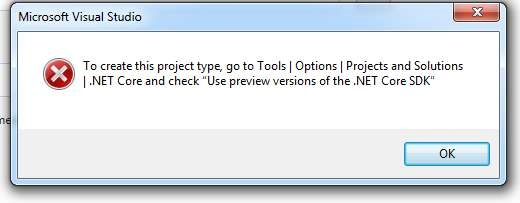 

#### 在vs的设置里，勾选.NET core下的"Use preview SDK"

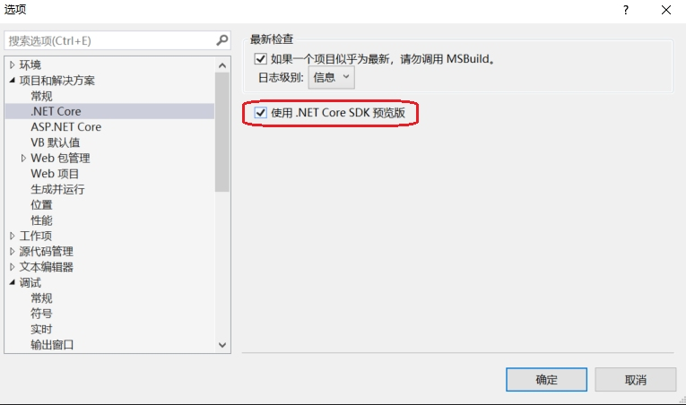 

设置完，重启vs才能生效。

#### 使用vs自带的模板，选择其中的 .net core forms 创建Project, 取名为"CoreHelloForm"

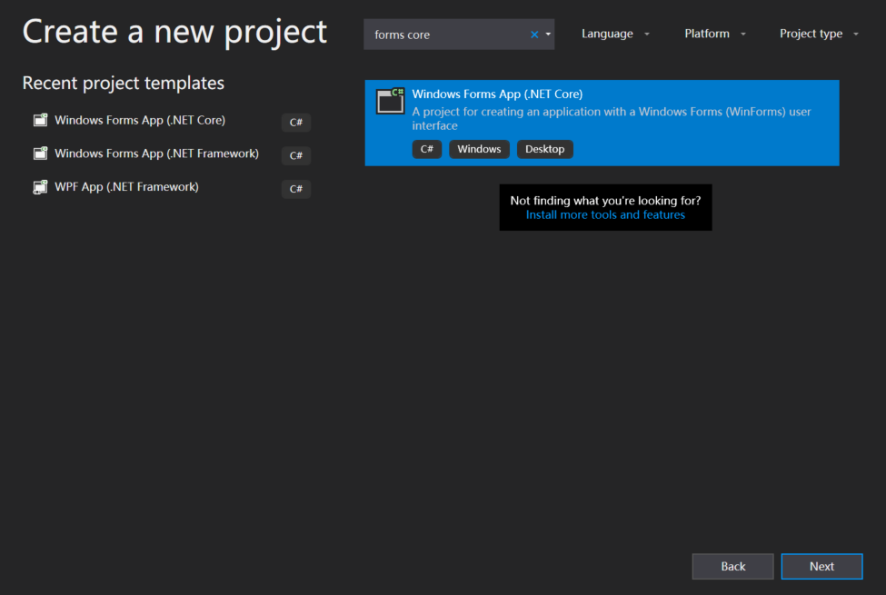

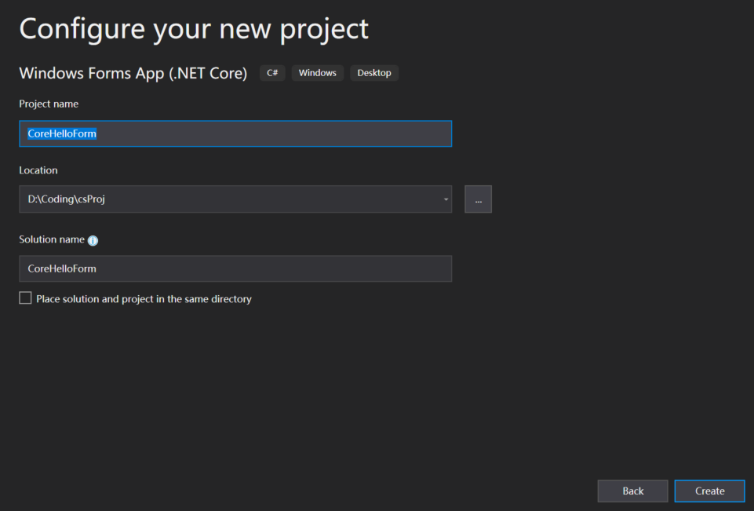

此时的文件目录为:

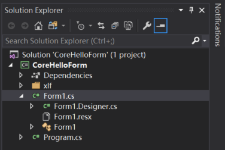

#### 在刚创建的solution中使用vs自带的模板，选择其中的.net framework forms添加新的project，取名为"CoreHelloForm.Designer"

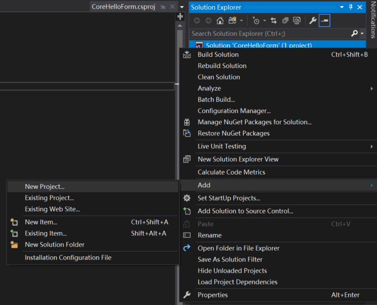

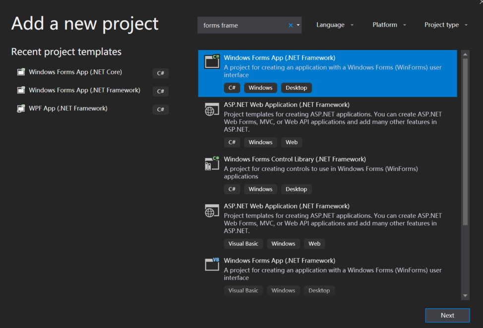

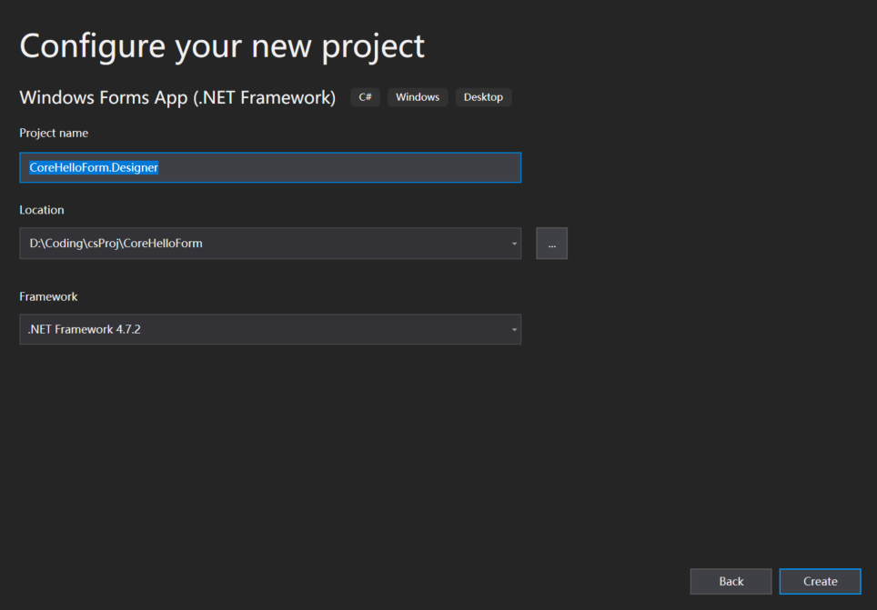

此时`Solution`中的文件目录为:

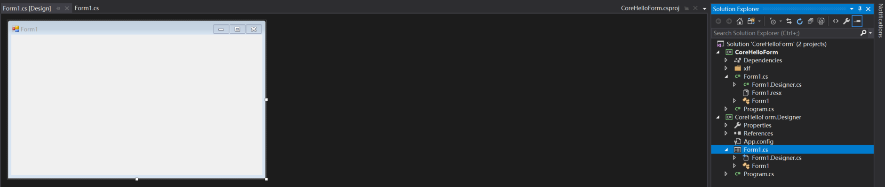

#### 将.net core form下的Form1 重命名为 MainForm

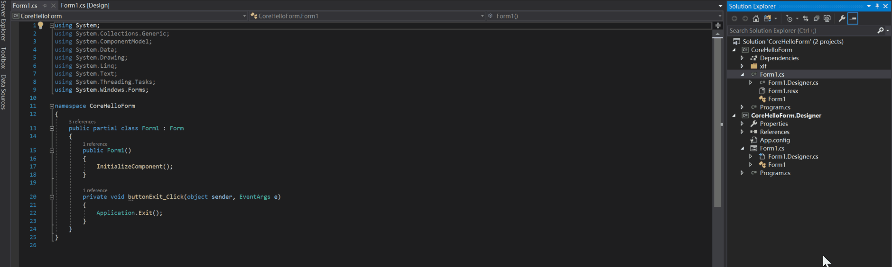

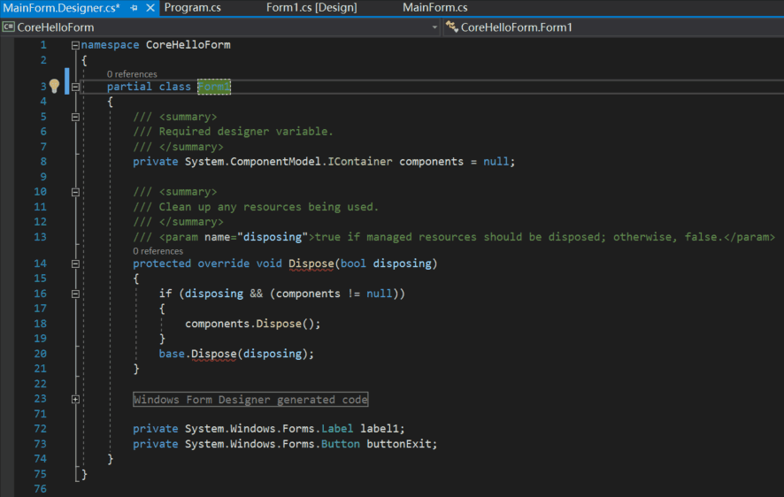

此时，选中 .net core form项目，右键选择 “Set as start up project”，按F5运行项目，可看到窗体:

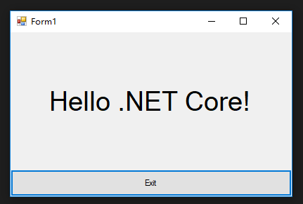

然后点窗体右上角的`x`，停止运行

#### 测试从命令行是否能正常 build `.net core`项目

右键 .net core form项目，点击"Open Folder in File Explorer",

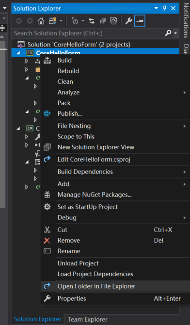

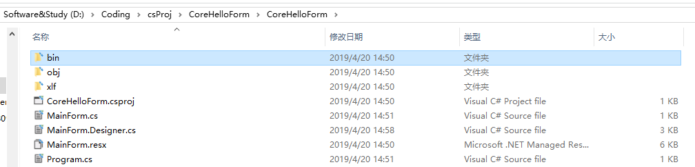

删除此处的`bin` 文件夹

在上方地址栏输入`cmd` 进入命令行:

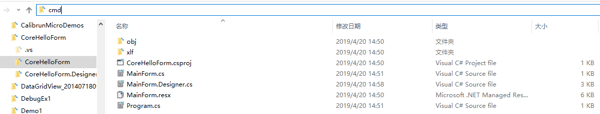

输入`dotnet --version`，看是否能看到具体.net core版本，如果没问题，继续下面的步骤。

输入`dotnet build`

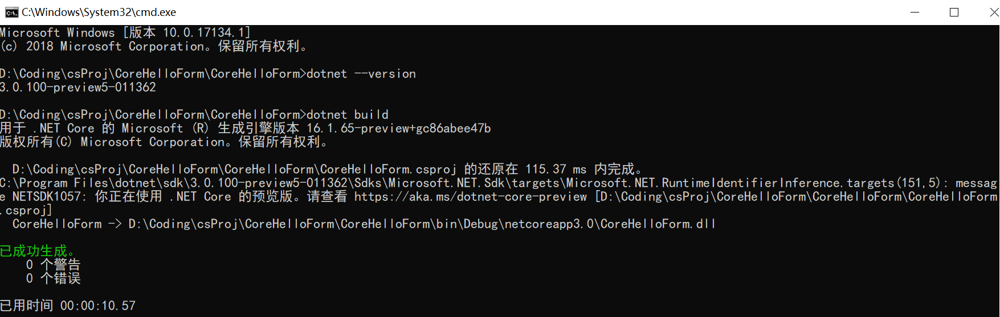

此时，回到文件目录`D:\Coding\csProj\CoreHelloForm\CoreHelloForm\bin\Debug\netcoreapp3.0`，双击其中的exe文件，窗体能正常打开。

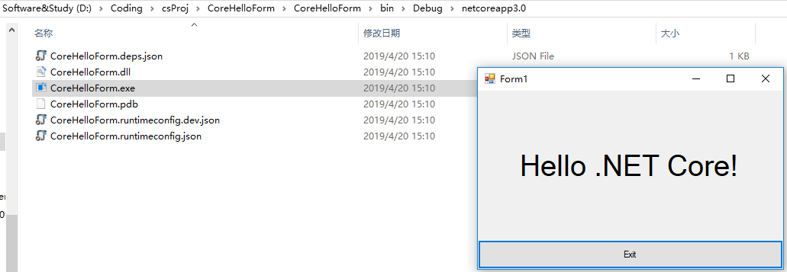

#### 删除项目`CoreHelloForm.Designer`中所有Form1相关的文件

接着选中`.net framework`项目`CoreHelloForm.Designer`下的`Form1`，右键点击"Delete"，

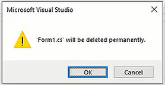

会出现下面这个警告框，点`OK`。

#### 在项目`CoreHelloForm.Designer中以"As Link"的方式引用.net core form项目下的MainForm相关文件

选中项目`CoreHelloForm.Designer`，右键Add，选"Existing Item"

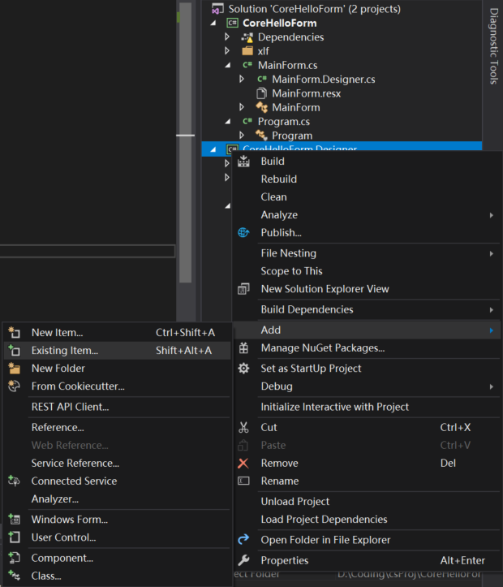

打开文件选择框之后，选择.net core项目`CoreHelloForm`下的下图中高亮的3个文件.

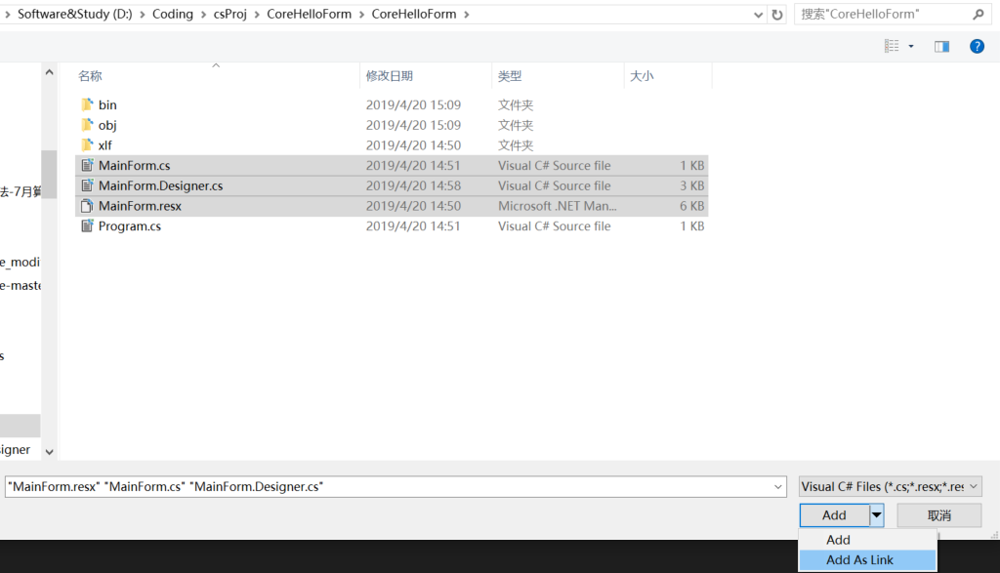

点击`Add As Link`。

#### 从extension market下载并安装扩展 File Nesting

下载地址: [File Nesting for VS](https://marketplace.visualstudio.com/items?itemName=MadsKristensen.FileNesting)

#### 使用 File Nesting来修改 Link 的 MainForm相关文件的层次关系.

先右键点击 "File Nesting" -> "Auto-nest selected items"

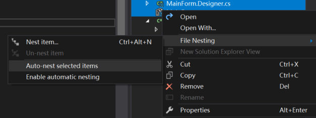

再右键点击 "File Nesting" -> "Nest item"，选择 `MainForm`

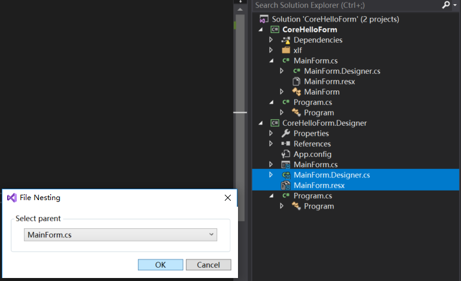

点 `OK `继续.

#### 再进行一次重命名

将`.Designer`项目下的`Program.cs`中的`Form1`改为`MainForm`.

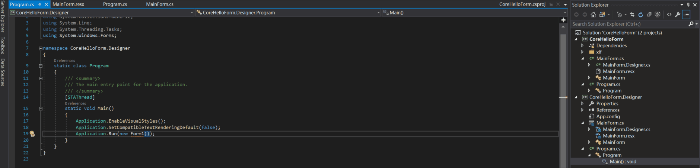

#### 重设启动项项目

选中项目CoreHelloForm.Designer，右键 Rebuild,  选中.net framework项目CoreHelloForm.Designer，右键选择 “Set as start up project”. 

#### 关闭 Solution中 项目CoreHelloForm.Designer中`MainForm`的干扰文件

此时，如果试着双击项目CoreHelloForm.Designer中的`MainForm.cs`，会弹出如下警告。

那是因为项目CoreHelloForm.Designer中的`MainForm.cs` 所Link 的与MainForm相关的文件已经在 项目CoreHelloForm 中 打开。

我们将已打开的文件中与项目`CoreHelloForm.Designer`中Form相关的文件都关闭掉，比如：

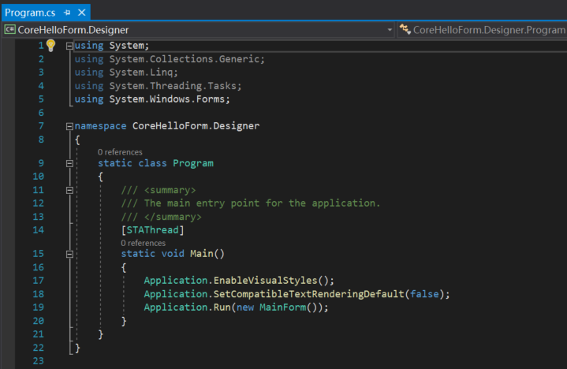

#### 试用 Designer

现在，再双击项目CoreHelloForm.Designer中的`MainForm.cs`，就能看到 Designer 了。

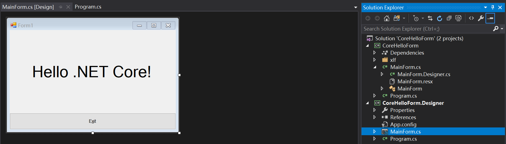

此时，可以进行可视化编辑了。

比如，我做了如下几处修改:

- 改掉 Form的 Title

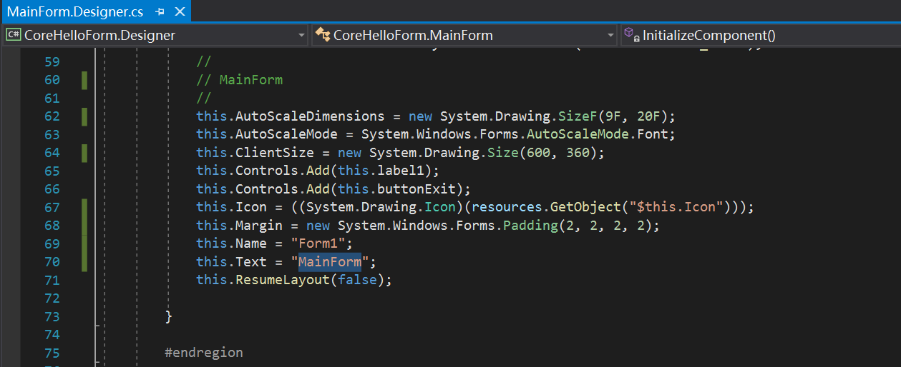

- 改掉文本框的内容.

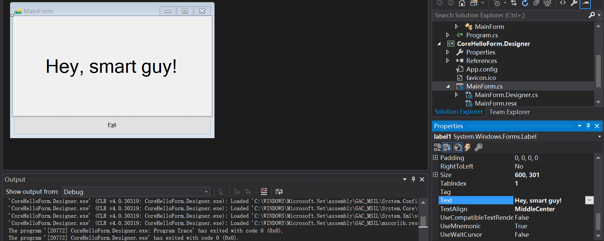

- 改掉窗体的图标(icon)

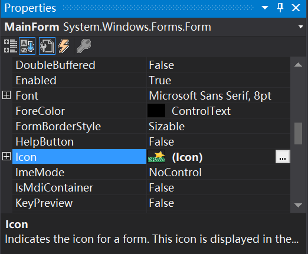

按`F5`，运行的效果图为:

项目代码已推到`github`，欢迎`Fork`和`star`.
传送门: [.netCore-WinForms_Designer](https://github.com/yanglr/.netCore-WinForms_Designer) .

**参考资料**

[WinForms Core App - A workaround invoking the Classic Framework Designer](https://github.com/dotnet/winforms/blob/1225f79dce17253a629d1a65c3c13f7a77cbaba1/Documentation/winforms-designer.md). 
